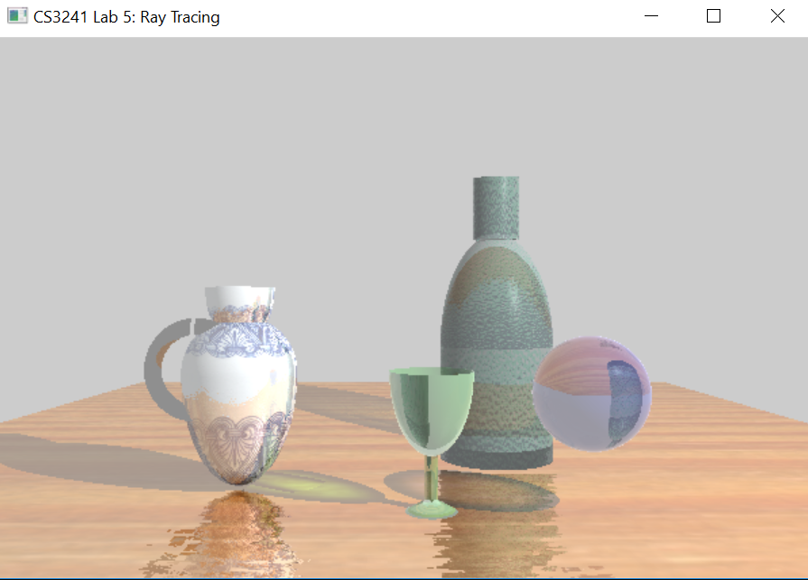
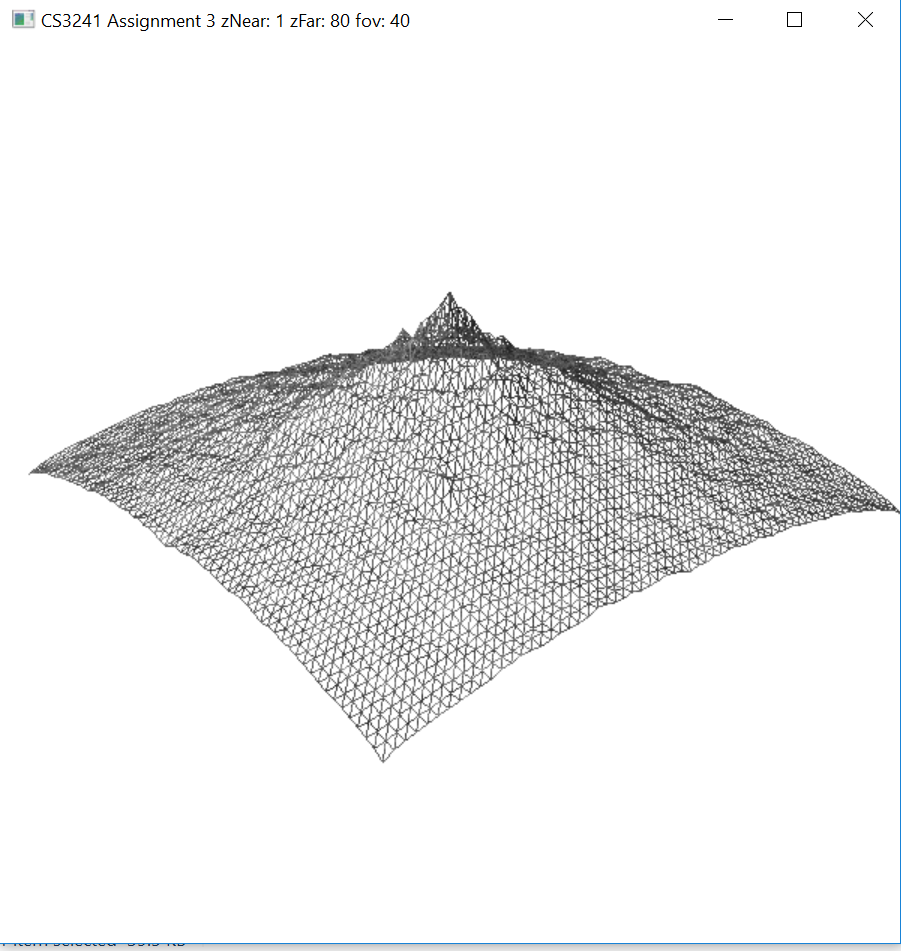
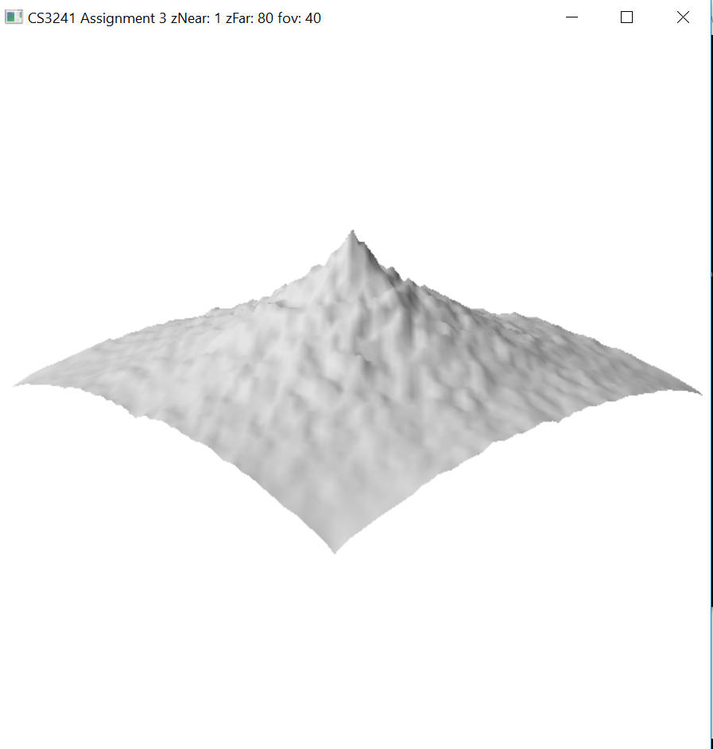
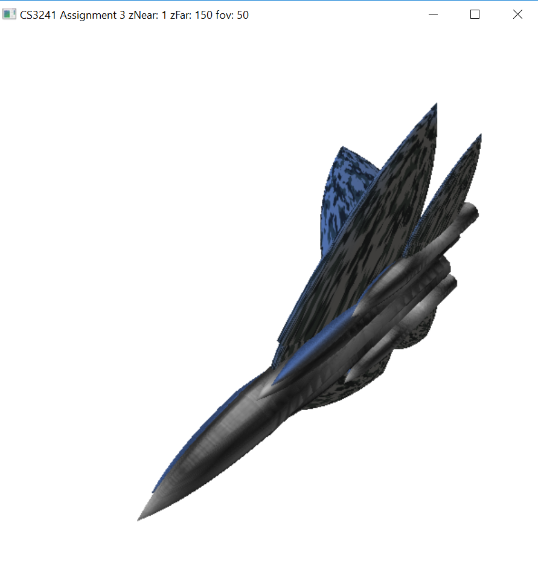
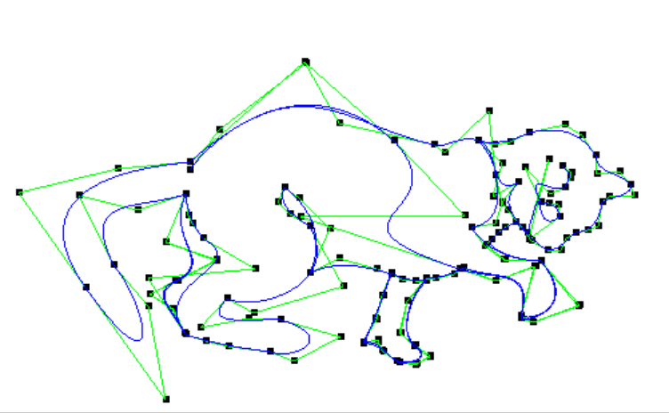

# CS3241Demo

## Featured - Lab5
* Scaling and composition of primitives to produce complex objects.
* Speed up raytracing using bounding volumes.
* "Simulated" caustics and fresnel effect using simple approximation.
* Texture and normal mapping.

## Lab1
* Hierachical transformations.

## Lab3
* Procedural generation using Diamond square algorithm.
* Shearing and composition of primitives to produce complex shapes.
* Dolly cam effect.
* Texture mapping.

## Lab4
* Bezier curves.
* Animation using key framing.

